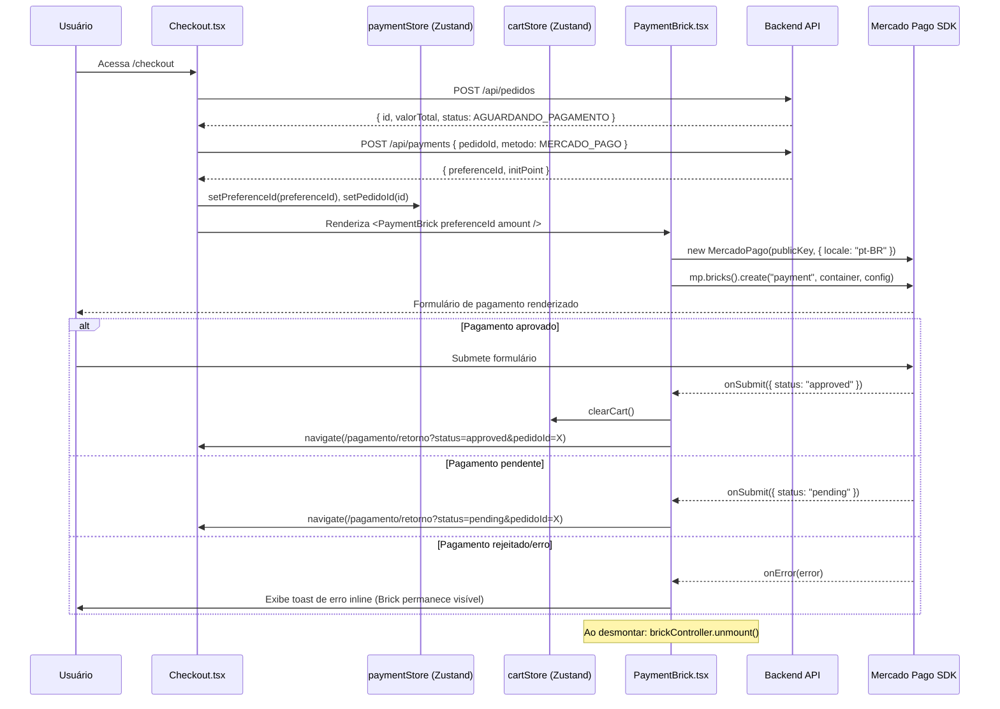

# Design: Pagamento Embutido (Embedded Payment)

## Visão Geral

Esta feature substitui o fluxo de checkout externo — que redirecionava o usuário para o site do Mercado Pago — pelo **Payment Brick** do SDK `@mercadopago/sdk-js`, mantendo o usuário na aplicação durante todo o processo de pagamento.

O fluxo atual em `Checkout.tsx` cria um pedido, obtém a `preferenceId` e redireciona para `initPoint`. O novo fluxo mantém o usuário na página e renderiza o formulário de pagamento inline via Brick.

**Decisão de design principal:** O Brick é inicializado no lado do cliente com a `preferenceId` já criada pelo backend. Isso evita criar preferências duplicadas e mantém o backend como fonte de verdade para o estado do pedido.

---

## Arquitetura



### Fluxo de estados do Checkout

```
idle
  → criando-pedido    (POST /api/pedidos em andamento)
  → criando-preferencia (POST /api/payments em andamento)
  → exibindo-brick    (preferenceId disponível, Brick renderizado)
  → processando       (usuário submeteu o formulário)
  → concluido         (approved/pending → redirect)
  → erro              (falha em qualquer etapa → mensagem + retry)
```

---

## Componentes e Interfaces

### PaymentBrick.tsx (novo)

Componente responsável por inicializar, renderizar e destruir o Payment Brick do Mercado Pago.

```typescript
interface PaymentBrickProps {
  preferenceId: string;
  amount: number;
  pedidoId: string;
  onApproved: () => void;   // chamado após clearCart + navigate
  onPending: () => void;    // chamado para navigate pending
  onError: (message: string) => void; // chamado para exibir erro inline
}
```

**Ciclo de vida:**
1. `useEffect` com `[preferenceId, amount]` — inicializa o SDK e cria o Brick
2. Armazena a referência do `brickController` em um `ref`
3. Função de cleanup do `useEffect` chama `brickController.current?.unmount()` — garante destruição exatamente uma vez ao desmontar

```typescript
// Estrutura interna do PaymentBrick.tsx
const brickControllerRef = useRef<BrickController | null>(null);

useEffect(() => {
  let cancelled = false;

  const initBrick = async () => {
    const mp = new MercadoPago(import.meta.env.VITE_MP_PUBLIC_KEY, {
      locale: "pt-BR",
    });
    const bricks = mp.bricks();
    const controller = await bricks.create("payment", "paymentBrick_container", {
      initialization: { amount, preferenceId },
      callbacks: {
        onSubmit: async ({ selectedPaymentMethod, formData }) => {
          // status vem no formData ou via polling — tratar approved/pending
        },
        onError: (error) => onError(error.message),
      },
    });
    if (!cancelled) {
      brickControllerRef.current = controller;
    }
  };

  initBrick();

  return () => {
    cancelled = true;
    brickControllerRef.current?.unmount();
    brickControllerRef.current = null;
  };
}, [preferenceId, amount]);
```

**Nota sobre `cancelled`:** A flag evita atribuir o controller ao ref após o componente já ter sido desmontado (race condition em React StrictMode).

### Checkout.tsx (atualizado)

Substitui o redirecionamento para `initPoint` pela renderização do `PaymentBrick`.

**Mudanças:**
- Adiciona estado `checkoutState: CheckoutState` (enum do fluxo de estados acima)
- Remove `window.location.href = initPoint`
- Renderiza `<PaymentBrick>` quando `checkoutState === 'exibindo-brick'`
- Exibe `<Skeleton>` / spinner durante `criando-pedido` e `criando-preferencia`
- Exibe mensagem de erro + botão "Tentar novamente" durante `erro`
- Chama `POST /api/payments` apenas uma vez por montagem (via `useRef<boolean>` para evitar double-invoke do StrictMode)

### PaymentReturn.tsx (atualizado)

**Mudanças:**
- Lê `?status=` além do `?collection_status=` já existente
- Prioridade: `status` > `collection_status` (para compatibilidade retroativa)
- Redireciona para `/` se nenhum parâmetro estiver presente

### paymentStore.ts (novo Zustand store)

```typescript
interface PaymentState {
  preferenceId: string | null;
  pedidoId: string | null;
  setPreferenceId: (id: string) => void;
  setPedidoId: (id: string) => void;
  reset: () => void;
}
```

### Variáveis de ambiente

```
# .env
VITE_MP_PUBLIC_KEY=TEST-549cf707-5c5a-4d17-8e8a-1376e846622b

# .env.exemplo
VITE_MP_PUBLIC_KEY=TEST-sua-public-key-aqui
```

---

## Modelos de Dados

### CheckoutState (enum de UI)

```typescript
type CheckoutState =
  | "idle"
  | "criando-pedido"
  | "criando-preferencia"
  | "exibindo-brick"
  | "processando"
  | "concluido"
  | "erro";
```

### BrickController (tipo do SDK MP)

```typescript
interface BrickController {
  unmount: () => void;
}
```

### PaymentSubmitData (callback do Brick)

```typescript
interface PaymentSubmitData {
  selectedPaymentMethod: string;
  formData: {
    status?: "approved" | "pending" | "rejected";
    [key: string]: unknown;
  };
}
```

### Parâmetros da Return Page

| Parâmetro | Valores | Fonte |
|---|---|---|
| `status` | `approved`, `pending`, `failure` | Novo (Payment Brick) |
| `collection_status` | `approved`, `pending`, `rejected` | Legado (redirect MP) |
| `pedidoId` | UUID | Adicionado pelo frontend |

---

## Correctness Properties

*A property is a characteristic or behavior that should hold true across all valid executions of a system — essentially, a formal statement about what the system should do. Properties serve as the bridge between human-readable specifications and machine-verifiable correctness guarantees.*

### Property 1: SDK inicializado com Public Key e locale corretos

*Para qualquer* Public Key válida configurada em `VITE_MP_PUBLIC_KEY`, o construtor `MercadoPago` deve ser chamado exatamente uma vez com aquela chave e com `locale: "pt-BR"`.

**Validates: Requirements 1.2, 1.4**

---

### Property 2: Payment_Store armazena dados da preferência

*Para qualquer* resposta válida de `POST /api/payments` contendo `{ preferenceId, initPoint }`, o `paymentStore` deve conter a `preferenceId` e o `pedidoId` correspondentes após a chamada.

**Validates: Requirements 2.2**

---

### Property 3: Chamada à API de preferência é feita exatamente uma vez

*Para qualquer* `pedidoId` válido, independentemente do número de re-renderizações do `Checkout.tsx`, `POST /api/payments` deve ser chamado exatamente uma vez durante a sessão de checkout para aquele pedido.

**Validates: Requirements 2.5**

---

### Property 4: Loading indicator presente durante criação da preferência

*Para qualquer* estado em que `checkoutState` seja `"criando-pedido"` ou `"criando-preferencia"`, o componente `Checkout.tsx` deve renderizar um indicador de carregamento e não renderizar o `PaymentBrick`.

**Validates: Requirements 2.4**

---

### Property 5: Brick inicializado com parâmetros corretos no container correto

*Para qualquer* combinação válida de `preferenceId` e `amount`, o método `bricks().create` deve ser chamado com `initialization: { amount, preferenceId }` e o container `"paymentBrick_container"` deve estar presente no DOM.

**Validates: Requirements 3.1, 3.2**

---

### Property 6: Brick destruído exatamente uma vez ao desmontar

*Para qualquer* instância do `PaymentBrick`, ao desmontar o componente, `brickController.unmount()` deve ser chamado exatamente uma vez e a referência deve ser nulificada.

**Validates: Requirements 3.4**

---

### Property 7: Aprovação limpa carrinho e redireciona com parâmetros corretos

*Para qualquer* `pedidoId` e resposta `status: "approved"` no callback `onSubmit`, `cartStore.clearCart()` deve ser chamado antes de `navigate`, e a URL de destino deve ser `/pagamento/retorno?status=approved&pedidoId={pedidoId}`.

**Validates: Requirements 4.1, 4.5**

---

### Property 8: Status de pagamento mapeia para URL de retorno correta

*Para qualquer* valor de `status` retornado pelo Brick (`"approved"` ou `"pending"`), a URL de navegação deve conter `status={valor}` e `pedidoId={pedidoId}`.

**Validates: Requirements 4.1, 4.3**

---

### Property 9: Rejeição mantém Brick visível

*Para qualquer* erro ou rejeição retornado pelo Brick, o componente `PaymentBrick` deve permanecer montado no DOM (o container `paymentBrick_container` deve continuar presente).

**Validates: Requirements 4.2, 4.4**

---

### Property 10: Return_Page mapeia status para mensagem correta

*Para qualquer* valor de `status` na query string (`approved`, `pending`, `failure`, ou valor desconhecido), a `PaymentReturn` deve renderizar a mensagem correspondente ao status recebido.

**Validates: Requirements 5.1, 5.2, 5.3, 5.4**

---

### Property 11: Pedido criado com status AGUARDANDO_PAGAMENTO

*Para qualquer* requisição válida a `POST /api/pedidos`, o pedido persistido deve ter `status: AGUARDANDO_PAGAMENTO` e esse status deve ser mantido enquanto nenhuma notificação de aprovação for recebida pelo Webhook.

**Validates: Requirements 6.1, 6.2**

---

### Property 12: Webhook idempotente

*Para qualquer* `mpPaymentId`, processar a notificação de webhook N vezes (N ≥ 1) deve resultar no mesmo estado final do pedido que processar uma única vez.

**Validates: Requirements 6.5**

---

### Property 13: Webhook approved atualiza pedido para PAGO

*Para qualquer* notificação de webhook com `type: "payment"` e `status: "approved"`, o pedido correspondente deve ter seu status atualizado para `PAGO`.

**Validates: Requirements 6.3**

---

### Property 14: Webhook com type != "payment" não altera estado do pedido

*Para qualquer* notificação de webhook com `type` diferente de `"payment"`, o status do pedido não deve ser alterado e o endpoint deve retornar HTTP 200.

**Validates: Requirements 6.4**

---

### Property 15: Webhook com assinatura inválida retorna HTTP 400

*Para qualquer* requisição ao endpoint de webhook que não passe na validação de assinatura do Mercado Pago, o backend deve retornar HTTP 400 e registrar o evento em log.

**Validates: Requirements 7.4, 7.5**

---

## Tratamento de Erros

| Cenário | Comportamento |
|---|---|
| `VITE_MP_PUBLIC_KEY` ausente | Checkout renderiza mensagem de erro de configuração, sem tentar inicializar o SDK |
| Falha em `POST /api/pedidos` | `checkoutState → "erro"`, exibe mensagem + botão retry |
| Falha em `POST /api/payments` | `checkoutState → "erro"`, exibe mensagem + botão retry |
| Brick falha ao renderizar (`onError`) | Toast de erro inline, Brick permanece no DOM para retry |
| Pagamento rejeitado | Mensagem de erro inline, Brick permanece visível |
| `?status` ausente na Return Page | Redireciona para `/` |
| Webhook com assinatura inválida | HTTP 400 + log |
| Webhook com type desconhecido | HTTP 200, sem alteração de estado |

**Estratégia de retry no Checkout:**
- O botão "Tentar novamente" reseta `checkoutState` para `"idle"` e reinicia o fluxo
- A flag `hasCalledPaymentAPI` (ref) é resetada junto para permitir nova chamada

---

## Estratégia de Testes

### Testes Unitários

Focados em exemplos específicos, casos de borda e pontos de integração:

- `PaymentBrick.tsx`: verifica que o container `paymentBrick_container` está no DOM quando `preferenceId` é fornecida
- `PaymentBrick.tsx`: verifica que `unmount` é chamado ao desmontar (mock do SDK)
- `Checkout.tsx`: verifica transições de estado (idle → criando-pedido → etc.)
- `PaymentReturn.tsx`: verifica redirecionamento para `/` quando `status` está ausente
- `PaymentReturn.tsx`: verifica mensagem correta para cada valor de `status`
- Backend `WebhookController`: verifica retorno HTTP 400 para assinatura inválida
- Backend `WebhookController`: verifica HTTP 200 para type != "payment"

### Testes de Propriedade (Property-Based Testing)

Biblioteca: **fast-check** (frontend TypeScript) e **jqwik** (backend Java/Spring).

Configuração mínima: **100 iterações** por propriedade.

Cada teste deve ser anotado com o tag de rastreabilidade:
`// Feature: embedded-payment, Property {N}: {texto da propriedade}`

**Propriedades a implementar:**

| Property | Biblioteca | Descrição |
|---|---|---|
| P2 | fast-check | Para qualquer `{ preferenceId, pedidoId }` válido, o store deve conter os valores após set |
| P3 | fast-check | Para qualquer sequência de re-renders, `POST /api/payments` é chamado exatamente uma vez |
| P5 | fast-check | Para qualquer `{ preferenceId, amount }`, os parâmetros passados ao SDK são corretos |
| P6 | fast-check | Para qualquer montagem/desmontagem, `unmount` é chamado exatamente uma vez |
| P7 | fast-check | Para qualquer `pedidoId`, approved → clearCart antes de navigate com URL correta |
| P8 | fast-check | Para qualquer status (approved/pending), URL de retorno contém status e pedidoId |
| P10 | fast-check | Para qualquer valor de status, Return_Page renderiza a mensagem correspondente |
| P11 | jqwik | Para qualquer pedido criado, status inicial é AGUARDANDO_PAGAMENTO |
| P12 | jqwik | Para qualquer mpPaymentId, N chamadas ao webhook resultam no mesmo estado |
| P13 | jqwik | Para qualquer notificação approved, pedido é atualizado para PAGO |
| P14 | jqwik | Para qualquer type != "payment", status do pedido não muda |
| P15 | jqwik | Para qualquer assinatura inválida, retorna HTTP 400 |

**Exemplo de anotação (fast-check):**
```typescript
// Feature: embedded-payment, Property 6: Brick destruído exatamente uma vez ao desmontar
it("unmount é chamado exatamente uma vez ao desmontar", () => {
  fc.assert(
    fc.property(fc.string(), fc.float({ min: 0.01 }), (preferenceId, amount) => {
      // arrange, act, assert
    }),
    { numRuns: 100 }
  );
});
```

**Exemplo de anotação (jqwik):**
```java
// Feature: embedded-payment, Property 12: Webhook idempotente
@Property(tries = 100)
void webhookIdempotente(@ForAll String mpPaymentId) {
  // processar N vezes → mesmo estado final
}
```
